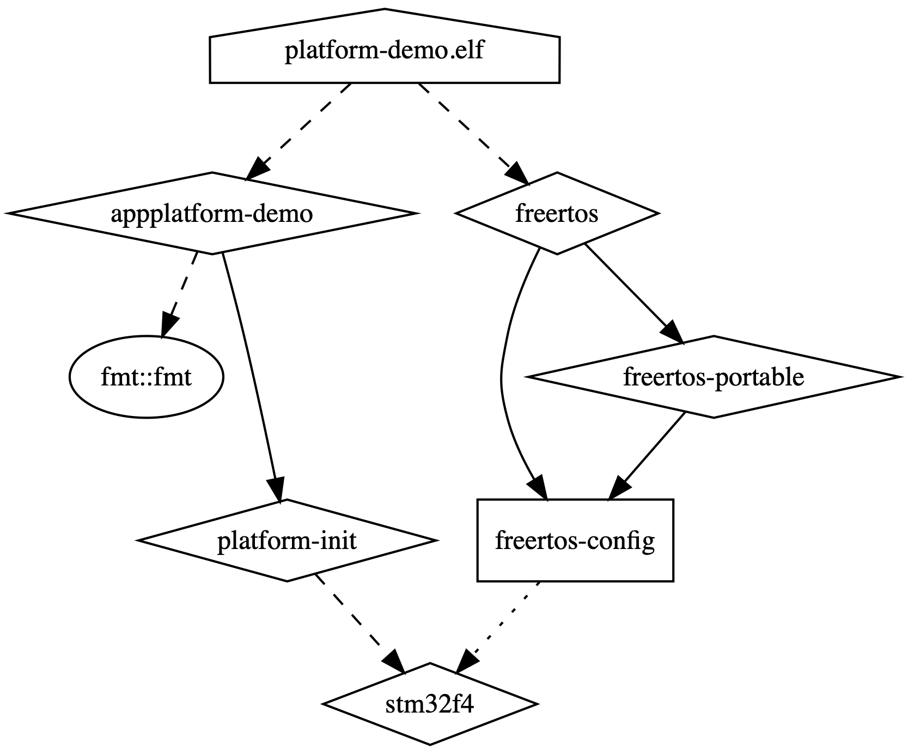

# 19 reasons why CMake is actually awesome

Topic of CMake is extremely controversial in the C/C++ community. People say that it is hard to properly set the include
paths, that syntax is archaic or that managing dependencies is a nightmare. Expressing public hate for CMake has become
a way of integrating with other software developers on the Internet.

And I partially understand that statements. Before CMake 3.x (aka Modern CMake) we were forced to use
`include_directories()` or manually set installation paths for libraries, that were not supported by default in CMake.
Syntax was a bit oldish and managing the compilation flags usually lead to headaches.

But since CMake 3.x (released on 06.2014) we have way more flexible and elegant ways of creating build systems with
CMake. Almost all cons are gone in favor of the new modern solutions. The only problem is that once a bad impression was
made, it is really hard to change it. After all, who would like to invest in studying new features and best practices of
a build system?! Well I do, and let me share with you 19 reasons, why CMake is actually awesome and you should give it a
try again.

<!-- more -->

!!! info

    For someone who is completely new to the topic: CMake is a build system generator, that creates build system files
    for common frameworks and IDE’s from a generic scripting language.


!!! note "Disclaimer"

    This article aims to give a brief overview of CMake capabilities without going deep into technical details. Consult
    the [official CMake docs][cmake-docs] for more details.

## 1. CMake is cross-platform

This one should be obvious since CMake has been cross-platform from the beginning. Currently it can run on all major
platforms:

- Windows,
- Linux,
- MacOS.

It means, that we can build projects which use CMake on all above platforms without additional platform-specific
configurations. No need to write Makefiles, configure Visual Studio projects, create custom Bash or batch files.
Everything is handled by CMake. Note, that I say “build on”, not “build for”. There is a clear separation between build
host and build target. Of course case when host and target is the same is assumed by default.

## 2. CMake supports multiple IDE’s and build frameworks

CMake is a build system generator (meta build system), which means that it creates configuration files for other
existing build systems. List of available options is dependent on the build host, which is natural (usually there is no
need to generate Visual Studio projects on Linux).

Below you can find a complete list (as for publication date) of all supported frameworks (CMake is calling them
generators):

- Borland Makefiles,
- MSYS Makefiles,
- MinGW Makefiles,
- NMake Makefiles,
- NMake Makefiles JOM,
- Unix Makefiles,
- Watcom WMake,
- Ninja,
- Visual Studio 6,
- Visual Studio 7,
- Visual Studio 7 .NET 2003,
- Visual Studio 8 2005,
- Visual Studio 9 2008,
- Visual Studio 10 2010,
- Visual Studio 11 2012,
- Visual Studio 12 2013,
- Visual Studio 14 2015,
- Visual Studio 15 2017,
- Visual Studio 16 2019,
- Green Hills MULTI,
- Xcode,
- CodeBlocks,
- CodeLite,
- Eclipse CDT4,
- Kate,
- Sublime Text 2.

Only by using different command line option you can target either MacOS XCode or Windows Visual Studio. Quite
impressive, wouldn’t you say?

3. CMake supports native shell commands/apps execution Despite being OS-independent, CMake still gives you ability to
execute custom host-specific shell commands or launch given application with the following commands:

- `execute_process()`,
- `add_custom_command()`.

However, this is not a good practice because it makes our build system tightly coupled with the concrete platform (which
is in contrary to the purpose of CMake).

## 4. CMake allows easy external project download and incorporation

In some cases we are forced to use some external projects from the remote location (e.g. Internet) or simply from
another local repository/disk directory. CMake has two integrated mechanisms for supporting that:

- `FetchContent()`,
- `ExternalProject_Add()`.
 
Both commands are almost identical except for one crucial difference: `FetchContent` is launched during the generation
time (when you call cmake) and `ExternalProject_Add` is launched during build time (e.g. when you call make).

Its usage is straightforward – you have to specify Git/SVN/file/other location and optional parameters (e.g. repository
branch) and CMake will automatically download and optionally build that project for you.

Here you have an example of downloading `libfmt` project from GitHub using `v11.0.2` tag:

```cmake linenums="1"
include(FetchContent)
FetchContent_Declare(fmt
    GIT_REPOSITORY https://github.com/fmtlib/fmt.git
    GIT_TAG        v11.0.2
    SYSTEM
)

FetchContent_MakeAvailable(fmt)
```

After that, you have `libfmt` downloaded in your build directory and added to the project. Now you can treat that it
like normal source path (in particular link with any targets defined by `libfmt` repo).

## 5. CMake supports cross-compilation like a champ

Cross-compilation (building for platform other than you use for compilation) has always scared me. A task nearly
impossible to do manually in a cross-platform manner.

CMake has this ability built-in and requires very little effort to make it work for you. All you need to do is to
provide the so called toolchain file. It is a normal CMake file, except it doesn’t require its name to be
`CMakeLists.txt` (actually I would prefer it to be called `<toolchain_name>.cmake`). Below you can see an example
toolchain file for arm-none-eabi-gcc toolchain (`arm-none-eabi-gcc.cmake`):

```cmake linenums="1"
set(CMAKE_SYSTEM_NAME               Generic)
set(CMAKE_SYSTEM_PROCESSOR          arm)

# Without that flag CMake is not able to pass test compilation check
set(CMAKE_TRY_COMPILE_TARGET_TYPE   STATIC_LIBRARY)

set(CMAKE_AR                        ${BAREMETAL_ARM_TOOLCHAIN_PATH}/bin/arm-none-eabi-ar)
set(CMAKE_ASM_COMPILER              ${BAREMETAL_ARM_TOOLCHAIN_PATH}/bin/arm-none-eabi-gcc)
set(CMAKE_C_COMPILER                ${BAREMETAL_ARM_TOOLCHAIN_PATH}/bin/arm-none-eabi-gcc)
set(CMAKE_CXX_COMPILER              ${BAREMETAL_ARM_TOOLCHAIN_PATH}/bin/arm-none-eabi-g++)
set(CMAKE_LINKER                    ${BAREMETAL_ARM_TOOLCHAIN_PATH}/bin/arm-none-eabi-ld)
set(CMAKE_OBJCOPY                   ${BAREMETAL_ARM_TOOLCHAIN_PATH}/bin/arm-none-eabi-objcopy CACHE INTERNAL "")
set(CMAKE_RANLIB                    ${BAREMETAL_ARM_TOOLCHAIN_PATH}/bin/arm-none-eabi-ranlib CACHE INTERNAL "")
set(CMAKE_SIZE                      ${BAREMETAL_ARM_TOOLCHAIN_PATH}/bin/arm-none-eabi-size CACHE INTERNAL "")
set(CMAKE_STRIP                     ${BAREMETAL_ARM_TOOLCHAIN_PATH}/bin/arm-none-eabi-strip CACHE INTERNAL "")
set(CMAKE_GCOV                      ${BAREMETAL_ARM_TOOLCHAIN_PATH}/bin/arm-none-eabi-gcov CACHE INTERNAL "")

set(COMMON_FLAGS                    "-Wno-psabi --specs=nosys.specs -fdata-sections -ffunction-sections -Wl,--gc-sections")
set(CMAKE_C_FLAGS                   "${COMMON_FLAGS} ${APP_C_FLAGS} " CACHE INTERNAL "")
set(CMAKE_CXX_FLAGS                 "${COMMON_FLAGS} -fno-exceptions ${APP_CXX_FLAGS}" CACHE INTERNAL "")

set(CMAKE_C_FLAGS_DEBUG             "-Os -g" CACHE INTERNAL "")
set(CMAKE_C_FLAGS_RELEASE           "-Os -DNDEBUG" CACHE INTERNAL "")
set(CMAKE_CXX_FLAGS_DEBUG           "${CMAKE_C_FLAGS_DEBUG}" CACHE INTERNAL "")
set(CMAKE_CXX_FLAGS_RELEASE         "${CMAKE_C_FLAGS_RELEASE}" CACHE INTERNAL "")

set(CMAKE_FIND_ROOT_PATH_MODE_PROGRAM NEVER)
set(CMAKE_FIND_ROOT_PATH_MODE_LIBRARY ONLY)
set(CMAKE_FIND_ROOT_PATH_MODE_INCLUDE ONLY)
```

As you can see, this file only sets paths to several tools from the toolchain and sets common compilation flags
(specific for that compiler).

In order to tell CMake to use this configuration you have to set the `CMAKE_TOOLCHAIN_FILE` variable before the call to
`project()` function. So you can either set it as a command line argument:

```bash
cmake <PATH_TO_SOURCES> -DCMAKE_TOOLCHAIN_FILE=<PATH_TO_TOOLCHAIN_FILE>
```

or as a normal variable in the root `CMakeLists.txt`:

```cmake linenums="1"
cmake_minimum_required(VERSION 3.15)

set(CMAKE_TOOLCHAIN_FILE <PATH_TO_TOOLCHAIN_FILE>)

project(<PROJECT_NAME> ...)

...
```

## 6. CMake makes it easy to handle include paths

Before CMake 3.x when you wanted to set the include paths for the current directory and everything below you had to
write:

```cmake
include_directories(<PATH_TO_INCLUDES>)
```

This is bad! Don’t do that unless you know what you are doing. This is an anti-pattern of software architecture. In
order to get the includes from another library you had to know its internal structure (to include the proper sets of
paths). And what if that library is changed? You have to adjust every time. Nightmare!

Wouldn’t it be nice if that library provided you with everything you need with one statement? Since modern CMake (3.x+)
it is possible! Library author can utilize the fact, that when you “link” with that library via `target_link_libraries`
(quite unfortunate name: [read this for a reason why][modern-cmake]) you “inherit” all its public properties. And the
include paths are the property of the library. They can set via `target_include_directories` function.

So in other words, the library sets its include paths as its “include” property and when you link with it you
automatically get them. No need to write anything manually. Also the internal structure of the library is completely
hidden:

=== ":octicons-file-code-16: `CMakeLists.txt` for library A"

    ```cmake linenums="1"
    add_library(A <LIBRARY_A_SOURCES>)

    target_include_directories(
        PUBLIC liba/include
    )
    ```

=== ":octicons-file-code-16: `CMakeLists.txt` for library B"

    ```cmake linenums="1"
    add_library(B <LIBRARY_B_SOURCES>)

    target_link_libraries(B
        PRIVATE A             # Here we automatically get the liba/include includes.
    )
    ```

!!! note

    `PUBLIC`, `PRIVATE` and `INTERFACE` specifiers are explained in [this][modern-cmake] article.

## 7. CMake makes it easy to handle compilation, linking and preprocessor flags

This paragraph is similar to the previous one. All the problems with the include paths are valid also for compilation,
linking and preprocessor flags. And we also want other libraries to provide all necessary flags to use them. CMake
allows that with the following functions:

- `target_compile_definitions(<PREPROCESSOR_FLAGS>)`,
- `target_compile_options(<COMPILATION_FLAGS>)`,
- `target_link_options(<LINKER_FLAGS>)`.

=== ":octicons-file-code-16: `CMakeLists.txt` for library A"

    ```cmake linenums="1"
    add_library(A <LIBRARY_A_SOURCES>)

    target_compile_definitions(
        PUBLIC -DUSE_TIMER -DNO_EXCEPTIONS
    )

    target_compile_options(
        PUBLIC —std=c++17
    )

    target_link_options(
        PUBLIC -T linker_script.ld
    )
    ```

=== ":octicons-file-code-16: `CMakeLists.txt` for library B"

    ```cmake linenums="1"
    add_library(B <LIBRARY_B_SOURCES>)

    target_link_libraries(B
        PRIVATE A             # Here we automatically get the -DUSE_TIMER -DNO_EXCEPTIONS —std=c++17 -T linker_script.ld flags.
    )
    ```

## 8. CMake is supported by all major C++ package managers

There are 3 major package managers for C++:

- [Conan][conan],
- [vcpkg][vcpkg],
- [Hunter][hunter].

All of them have built-in native support for CMake. This article is already too long to show examples for each manager,
so you have to trust me on this. Each of them is easy to use and doesn’t make a mess in your carefully crafted
`CMakeLists.txt` files.

## 9. CMake is backward compatible

CMake is an actively developed project and new versions are released quite often. Some of them add new features and some
slightly modify existing ones. Within the development team, people may be using different operating systems and
different versions of that systems. It is very likely that there will be at least few different versions of CMake in use
among project members. This could get messy if someone uses feature that is not available for everyone. Also bugs in
CMake may be different for everyone.

In order to tame the chaos CMake introduced policies, which strictly define how particular CMake feature should behave.
Every CMake version has a set of its default policies and is able to load those sets for every previous version. So for
example despite having CMake 3.15 we can enforce the binary to behave like version 3.7.

We can do that by specifying the following statement:

```cmake
cmake_minimum_required(VERSION <CMAKE_VERSION_TO_BE_USED>)
```

It is mandatory to set CMake version in the at the beginning of the root `CMakeLists.txt`, but we can change that later
in any place (however I strongly advice against that!).

## 10. CMake is supported by many IDEs
By this I mean, that many IDEs can use existing CMakeLists.txt directly as a project file. All you have to do is point
to the root CMakeLists.txt.

Here is a list of the most popular ones:

- [CLion][clion],
- [Visual Studio Code][vscode],
- [QtCreator][qtcreator],
- [Visual Studio][vs],
- [NetBeans][netbeans],
- [KDevelop][kdevelop].

## 11. CMake allows basic file manipulation

Sometimes during configure or build time we need to interact with our filesystem. It usually is a simple operation like
reading contents of the file (e.g. containing compilation flags) or copying (e.g. from resource directory to the build
directory).

CMake offers basic file manipulation functions, just like in the system console. Below you can find an extract from the
[official CMake file commands documentation][cmake-file]:

``` linenums="1"
Reading
  file(READ <filename> <out-var> [...])
  file(STRINGS <filename> <out-var> [...])
  file(<HASH> <filename> <out-var>)
  file(TIMESTAMP <filename> <out-var> [...])
  file(GET_RUNTIME_DEPENDENCIES [...])

Writing
  file({WRITE | APPEND} <filename> <content>...)
  file({TOUCH | TOUCH_NOCREATE} [<file>...])
  file(GENERATE OUTPUT <output-file> [...])

Filesystem
  file({GLOB | GLOB_RECURSE} <out-var> [...] [<globbing-expr>...])
  file(RENAME <oldname> <newname>)
  file({REMOVE | REMOVE_RECURSE } [<files>...])
  file(MAKE_DIRECTORY [<dir>...])
  file({COPY | INSTALL} <file>... DESTINATION <dir> [...])
  file(SIZE <filename> <out-var>)
  file(READ_SYMLINK <linkname> <out-var>)
  file(CREATE_LINK <original> <linkname> [...])

Path Conversion
  file(RELATIVE_PATH <out-var> <directory> <file>)
  file({TO_CMAKE_PATH | TO_NATIVE_PATH} <path> <out-var>)

Transfer
  file(DOWNLOAD <url> <file> [...])
  file(UPLOAD <file> <url> [...])

Locking
  file(LOCK <path> [...])
```

All of of this in a cross-platform manner.

## 12. CMake offers similar functionality as system shell

Most of the operations that you would like to perform on variables in Bash or any other shell along with basic flow
control and code organization can be done in CMake as well. We are talking here about:

- setting/getting value of the variable,
- loops,
- functions and macros,
- lists manipulation,
- conditional branches (`if`/`else if`/`else`),
- setting/unsetting environmental variables,
- and much more.

## 13. CMake can be launched with GUI

Yes, CMake comes with a full-featured GUI (however it may require installation of an additional package). Consult the
[official CMake GUI docs][cmake-gui].

## 14. CMake has ability to locate installed libraries in the system

Dependency management can be really painful when it comes to handling external libraries. Especially, if we have to rely
on their presence in the system. Each OS or even package can have a different default installation path.

CMake has a built-in function to locate a predefined set of packages by name and automatically set variables with
include paths, sources or even expose whole “modern” target which has it all set as properties:

```cmake linenums="1"
find_package(Boost 1.56 REQUIRED COMPONENTS date_time filesystem iostreams)

add_executable(foo foo.cpp)

target_link_libraries(foo PRIVATE Boost::date_time Boost::filesystem Boost::iostreams)
```

The list of supported libraries is too long (as of CMake 3.16) to put it here, but feel free to check it in the
[official docs][cmake-modules].

!!! note

    You can also specify an additional location with your own packages finder files.

## 15. CMake allows creating static, shared and header-only libraries

You can explicitly tell CMake to create a static (default) or shared library by adding an extra parameter to
`add_library`:

```cmake
add_library(<NAME> [SHARED | STATIC] <SOURCES>)
```

Header-only libraries are a bit less obvious to create, but still quite easy. All you need to do is to:

- specify that given library is an interface (no binary is produced): `add_library(<NAME> INTERFACE)`,
- set its interface include path to the location of your headers: `target_include_directories(<NAME> INTERFACE .)`.

## 16. CMake allows code/files generation

Sometimes we want to add some compile-time information to our sources, that will be automatically computed or generated.
An excellent example would be a string with the project version.

One way of having that would be to change manually this value directly in the header. And it is OK. But what if this
value has to be used in multiple contexts, some of which are not inside the source code? For example in documentation,
in some build artifact etc. You may also want to extract this value from git tag. What then?

Fortunately CMake has a generic way of creating new files from a predefined template. All you need to do is to create a
file that you want to be generated and replace all its “variable” parts with the CMake variable notation.

Then you can call `configure_file()` command and CMake will create a copy of that template and replace all “variable”
parts with the corresponding values, known at that time. Here is an example with version string (there is a common
notation, where templates have the `.in` suffix):

=== ":octicons-file-code-16: `version.h.in`"

    ```cpp linenums="1"
    #pragma once 

    static const char* cVersion = "@MY_VERSION@"; 
    ```

=== ":octicons-file-code-16: `CMakeLists.txt`"

    ```cmake linenums="1"
    set(MY_VERSION "1.0.5b")

    configure_file(version.h.in ${CMAKE_CURRENT_SOURCE_DIR}/version.h)
    ```

This configuration will produce after “generation” step the following file:

=== ":octicons-file-code-16: `version.h`"

    ```cpp linenums="1"
    #pragma once 

    static const char* cVersion = "1.0.5b";
    ```

## 17. CMake allows generation of Doxygen docs without the hardcoded config

For some people it would be beneficial to be able to modify Doxygen configuration at build time or even completely
remove it.

CMake has a built-in function, that can add a Doxygen generation target to you build. You can also modify all settings
typically found in Doxygen config by setting CMake variables with the `DOXYGEN_` prefix.

Here is an example:

```cmake linenums="1"
find_package(Doxygen)
if (DOXYGEN_FOUND)
    set(DOXYGEN_OUTPUT_DIRECTORY        ${CMAKE_BINARY_DIR}/docs) 
    set(DOXYGEN_GENERATE_LATEX          NO)
    set(DOXYGEN_EXTRACT_PRIVATE         YES)
    set(DOXYGEN_EXTRACT_PACKAGE         YES)
    set(DOXYGEN_EXTRACT_STATIC          YES)
    set(DOXYGEN_WARN_NO_PARAMDOC        YES)
    set(DOXYGEN_HTML_OUTPUT             .)
    set(DOXYGEN_USE_MDFILE_AS_MAINPAGE  README.md)
    set(DOXYGEN_FILE_PATTERNS           *.c *.cc *.cxx *.cpp *.c++ *.ii *.ixx *.ipp *.i++ *.inl *.h *.hh *.hxx *.hpp *.h++ *.inc README.md)

    doxygen_add_docs(doxygen . WORKING_DIRECTORY ${PROJECT_SOURCE_DIR})
endif ()
```

## 18. CMake automatically detects required compiler for the given file

You don’t have to create a separate source lists for different compilers (e.g. one for C, one for C++, one for ASM).
Once you enable given language in the `project()` command CMake will automatically use the correct tool basing on the
file extension.

Here is an example of an executable built from both C and C++ files. They are all defined as one list of sources:

```cmake linenums="1"
cmake_minimum_required(VERSION 3.15)

project(test LANGUAGES C CXX)

add_executable(testExec main.cpp moduleA.c moduleB.cpp)
```

## 19. CMake can create dependency graph

Software architects or technical leaders may be really interested in the dependencies between the project modules and
their nature (`PUBLIC`, `INTERFACE`, `PRIVATE`). CMake can help visualize that in a form of a `dot` graph, which can be
later converted into an image.

All you need to is to pass `—-graphviz=<name>.dot` parameter to the CMake command line and it will generate it in the
build directory with the given name:

```bash
cmake <PATH_TO_SOURCES> --graphviz=graph/test.dot
```

Here is an example graph (`graph/test.dot`):



## Summary

CMake is a powerful tool. It may have been hard to use in the past, but now with a bit of a good will it can really
empower you in managing even most complicated build systems. Give it a try and I know you won’t regret it.

<!-- Links -->

[cmake-docs]: https://cmake.org/cmake/help/latest/index.html
[modern-cmake]: modern-cmake-is-like-inheritance.md
[conan]: https://conan.io/
[vcpkg]: https://github.com/microsoft/vcpkg
[hunter]: https://hunter.readthedocs.io/en/latest/
[clion]: https://www.jetbrains.com/clion/
[vscode]: https://code.visualstudio.com/
[qtcreator]: https://www.qt.io/download
[vs]: https://visualstudio.microsoft.com/
[netbeans]: https://netbeans.apache.org/
[kdevelop]: https://kdevelop.org/
[cmake-file]: https://cmake.org/cmake/help/latest/command/file.html
[cmake-gui]: https://cmake.org/cmake/help/latest/manual/cmake-gui.1.html
[cmake-modules]: https://cmake.org/cmake/help/latest/manual/cmake-modules.7.html#find-modules
